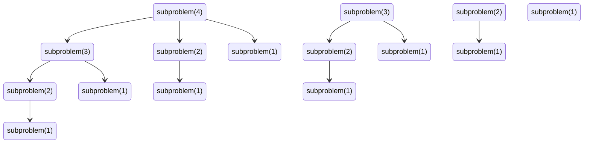
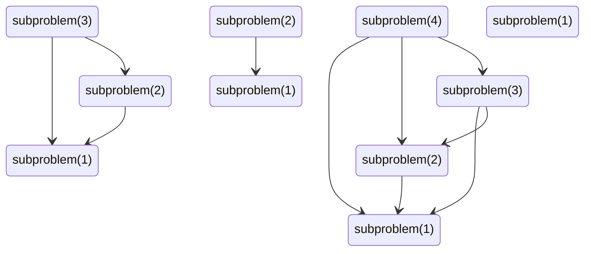
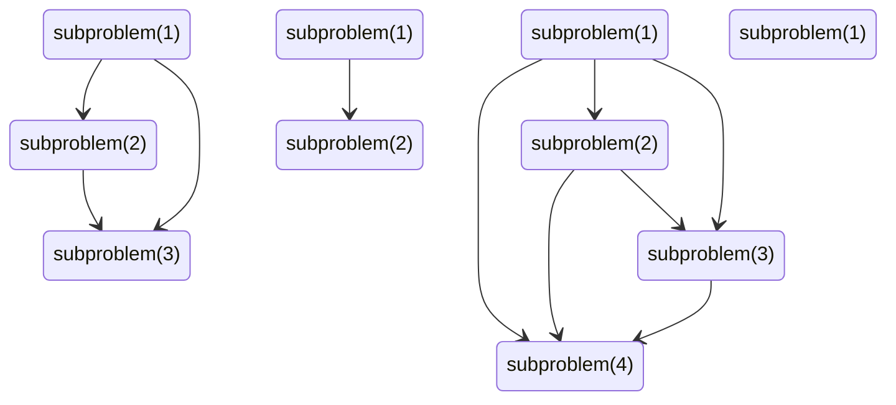

## Backtrack



```js
function longestIncreasingSubsequence(arr) {
  function subproblem(index) {
    if (index == 0) {
      return 1
    }

    let max = 1
    for (let i = index - 1; i >= 0; i--) {
      if (arr[i] < arr[index]) {
        max = Math.max(max, 1 + subproblem(i))
      }
    }
    
    return max
  }

  let max = 1
  for (let i = 0; i < arr.length; i++) {
    max = Math.max(max, subproblem(i))
  }

  return max
}
```

## Dynamic Programming

### Memoization



```js
function longestIncreasingSubsequence(arr) {
  let subproblemMemo = []

  function subproblem(index) {
    if (index == 0) {
      return 1
    }

    if (subproblemMemo[index]) {
      return subproblemMemo[index]
    }

    let max = 1
    for (let i = index - 1; i >= 0; i--) {
      if (arr[i] < arr[index]) {
        max = Math.max(max, 1 + subproblem(i))
      }
    }

    if (max > subproblemMemo[index]) {
      subproblemMemo[index] = max
    }
    
    return max
  }

  let max = 1
  for (let i = 0; i < arr.length; i++) {
    max = Math.max(max, subproblem(i))
  }

  return max
}
```

### Tabulation



```js
function longestIncreasingSubsequence(arr) {
  let subproblemTable = new Array(arr.length).fill(0);
  let max = 0;

  for (let i = 1; i < n; i++) {
    for (let j = 0; j < i; j++) {
      if (arr[i] > arr[j] && subproblemTable[i] < subproblemTable[j] + 1) {
        subproblemTable[i] = subproblemTable[j] + 1;
      }
    }
  }

  for (i = 0; i < n; i++) {
    if (max < subproblemTable[i]) {
      max = subproblemTable[i]; 
    }
  }

  return max;
}
```
