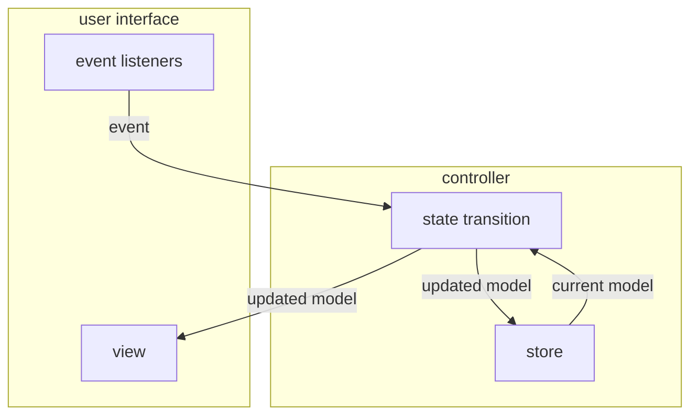

```mermaid
flowchart TB
    subgraph user interface
        B[event listeners]
        view
    end

    subgraph controller
        store
        A[state transition]
    end

    store -->|current model| A
    B -->|event| A[state transition]
    A -->|updated model| view
    A -->|updated model| store
```
