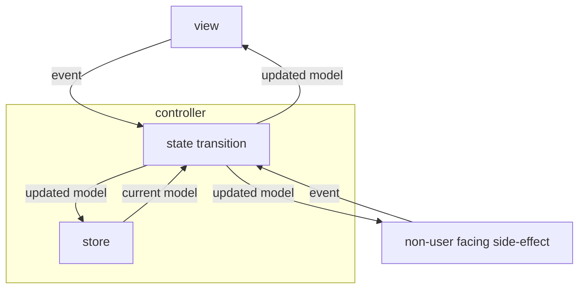

### Data flow graph

```mermaid
flowchart TB
    view
    C[non-user facing side-effect]

    subgraph controller
        store
        A[state transition]
    end

    store -->|current model| A
    view -->|event| A[state transition]
    A -->|updated model| view
    A -->|updated model| store
    A -->|updated model| C
    C -->|event| A
```
