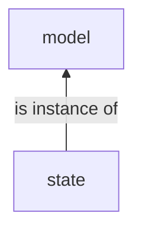
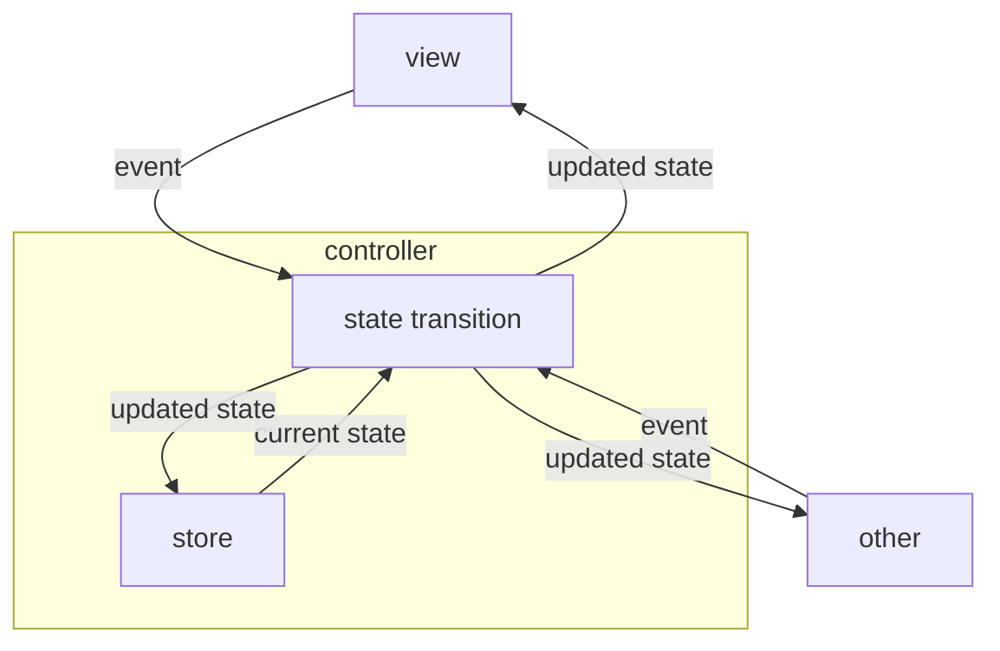
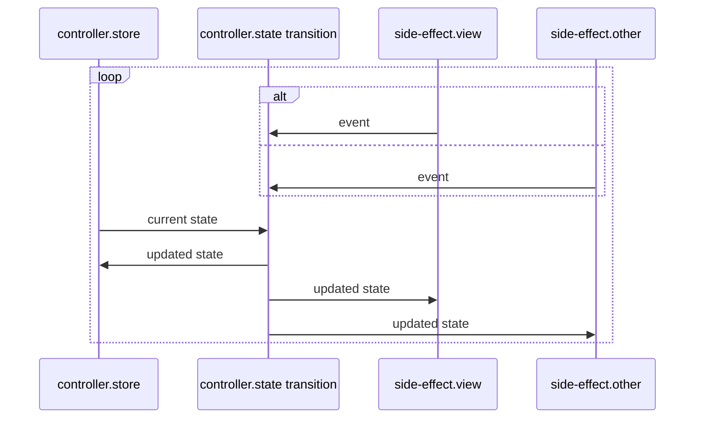

### Instance graph

```mermaid
graph BT
    A[state] -->|is instance of| B[model]
```

### Data flow graph

```mermaid
flowchart TB
    view
    C[other]

    subgraph controller
        store
        A[state transition]
    end

    store -->|current state| A
    view -->|event| A[state transition]
    A -->|updated state| view
    A -->|updated state| store
    A -->|updated state| C
    C -->|event| A
```

### Sequence diagram

```mermaid
sequenceDiagram
    participant controller.store
    participant controller.state transition
    loop
        alt
            side-effect.view->>controller.state transition: event
        else
            side-effect.other->>controller.state transition: event
        end
        controller.store->>controller.state transition: current state
        controller.state transition->>controller.store: updated state
        controller.state transition->>side-effect.view: updated state
        controller.state transition->>side-effect.other: updated state
    end
```
