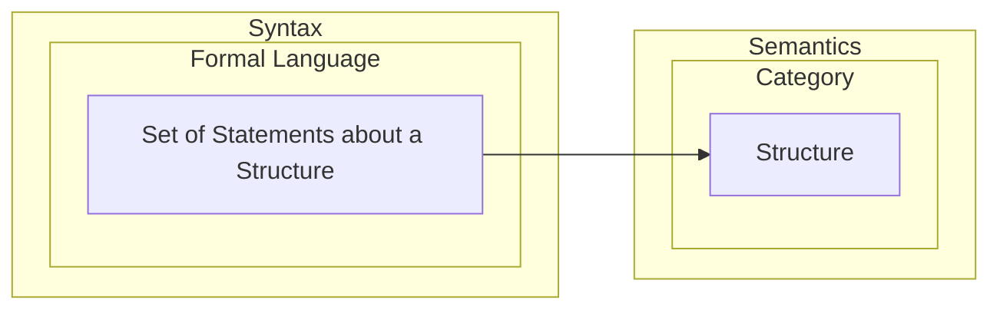
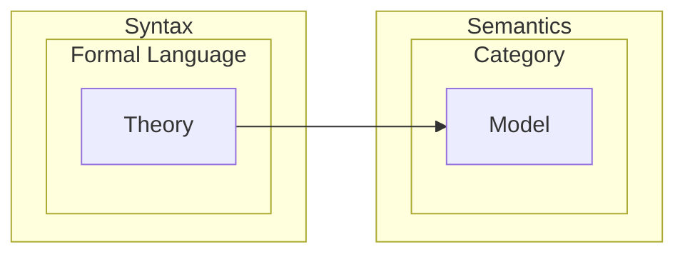
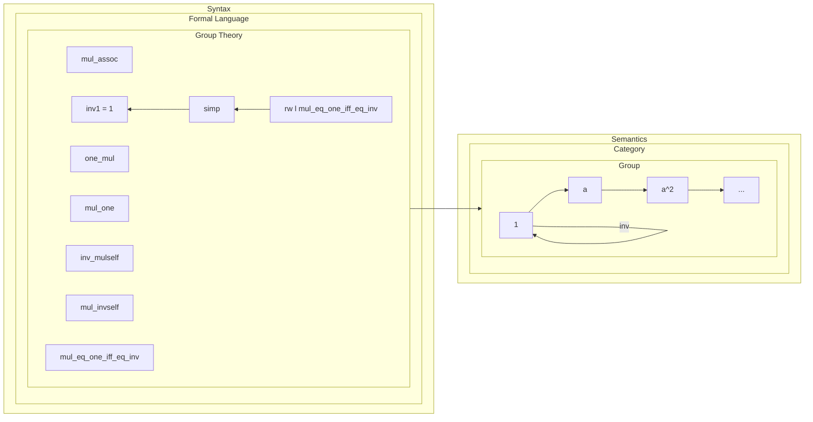

```mermaid
flowchart LR
    L000[Set of Statements about a Structure] --> R000[Structure]
    subgraph L0[Syntax]
        subgraph L00[Formal Language]
            L000[Set of Statements about a Structure]
        end
    end
    subgraph R0[Semantics]
        subgraph R00[Category]
            R000[Structure]
        end
    end
```

```mermaid
flowchart LR
    L000[Theory] --> R000[Model]
    subgraph L0[Syntax]
        subgraph L00[Formal Language]
            L000[Theory]
        end
    end
    subgraph R0[Semantics]
        subgraph R00[Category]
            R000[Model]
        end
    end
```

```mermaid
flowchart LR
    L000[Group Theory] --> R000[Group]
    subgraph L0[Syntax]
        subgraph L00[Formal Language]
            subgraph L000[Group Theory]
                direction RL
                mul_assoc
                one_mul
                mul_one
                A[inv_mulself]
                B[mul_invself]
                mul_eq_one_iff_eq_inv
                L0000[rw l mul_eq_one_iff_eq_inv] --> L0001[simp] --> L0002[inv1 = 1]
            end
        end
    end
    subgraph R0[Semantics]
        subgraph R00[Category]
            subgraph R000[Group]
                direction LR
                R00000[1] --> R00001[a] --> R00002[a^2] --> R00003[...]
                R00000[1] --> |inv| R00000[1]
            end
        end
    end
        
```
    
