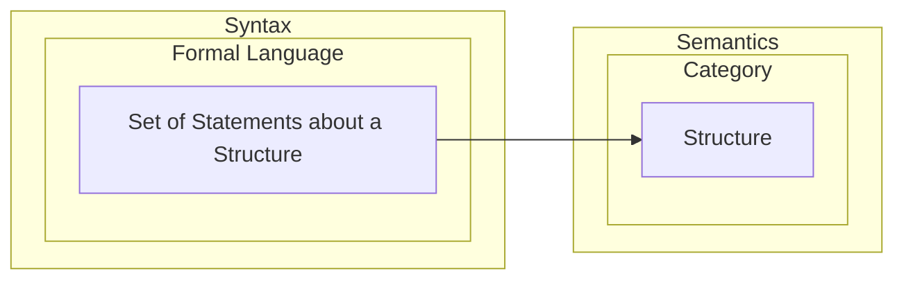
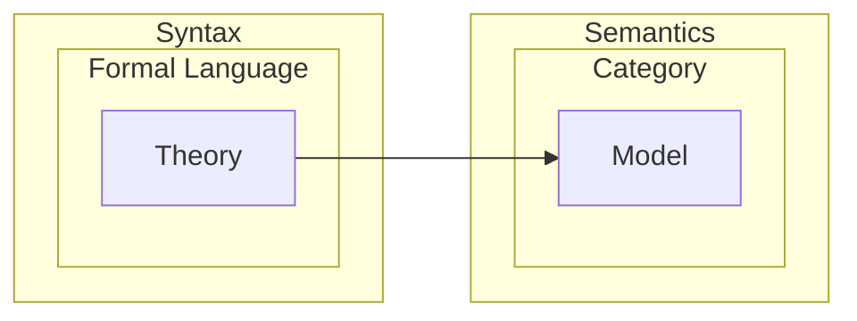
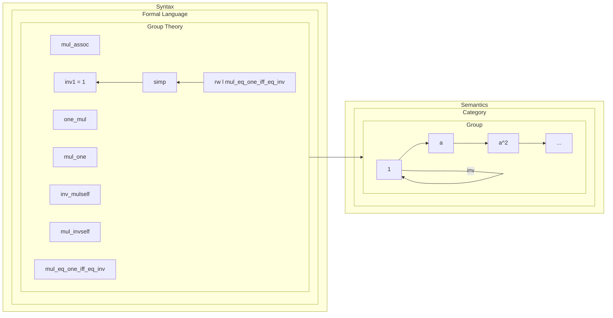
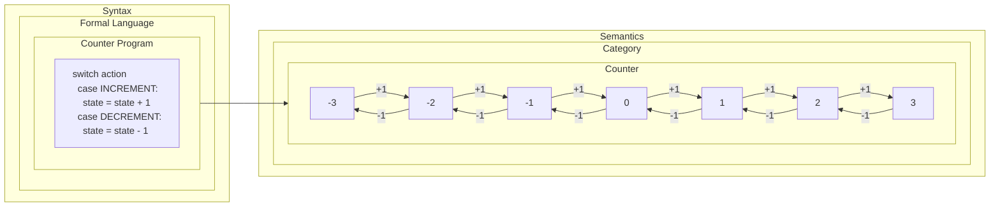

```mermaid
flowchart LR
    L000[Set of Statements about a Structure] --> R000[Structure]
    subgraph L0[Syntax]
        subgraph L00[Formal Language]
            L000[Set of Statements about a Structure]
        end
    end
    subgraph R0[Semantics]
        subgraph R00[Category]
            R000[Structure]
        end
    end
```

```mermaid
flowchart LR
    L000[Theory] --> R000[Model]
    subgraph L0[Syntax]
        subgraph L00[Formal Language]
            L000[Theory]
        end
    end
    subgraph R0[Semantics]
        subgraph R00[Category]
            R000[Model]
        end
    end
```

```mermaid
flowchart LR
    L000[Group Theory] --> R000[Group]
    subgraph L0[Syntax]
        subgraph L00[Formal Language]
            subgraph L000[Group Theory]
                direction RL
                mul_assoc
                one_mul
                mul_one
                A[inv_mulself]
                B[mul_invself]
                mul_eq_one_iff_eq_inv
                L0000[rw l mul_eq_one_iff_eq_inv] --> L0001[simp] --> L0002[inv1 = 1]
            end
        end
    end
    subgraph R0[Semantics]
        subgraph R00[Category]
            subgraph R000[Group]
                direction LR
                R00000[1] --> R00001[a] --> R00002[a^2] --> R00003[...]
                R00000[1] --> |inv| R00000[1]
            end
        end
    end
        
```

```mermaid
flowchart LR
    L000[Group Theory] --> R000[Group]
    subgraph L0[Syntax]
        subgraph L00[Formal Language]
            subgraph L000[Counter Program]
               A["switch action <br/> #nbsp; case INCREMENT: <br/> #nbsp; #nbsp; state = state + 1 <br/> #nbsp; case DECREMENT: <br/> #nbsp; #nbsp; state = state - 1"] 
               style A text-align:left
            end
        end
    end
    subgraph R0[Semantics]
        subgraph R00[Category]
            subgraph R000[Counter]
                direction LR
                R00000[-3] --> |+1| R00001[-2] --> |+1| R00002[-1] --> |+1| R00003[0] --> |+1| R00004[1] --> |+1| R00005[2] --> |+1| R00006[3]
                R00006[3] --> |-1| R00005[2] --> |-1| R00004[1] --> |-1| R00003[0] --> |-1| R00002[-1] --> |-1| R00001[-2] --> |-1| R00000[-3]
            end
        end
    end
```
    
